# Multimodal Emotion Recognition

This project detects emotions from speech, text, and combined speech + text
inputs using a multimodal deep learning pipeline. It provides trained models,
training notebooks, evaluation artifacts, and a Gradio app for interactive
testing.

## What This Project Does

- Speech emotion classification using HuBERT embeddings and a Keras model
- Text emotion classification using BERT embeddings and a Keras model
- Fusion-based emotion classification using concatenated speech and text
  embeddings
- Interactive inference using a Gradio web interface

## Architecture Diagrams

### Complete Pipeline

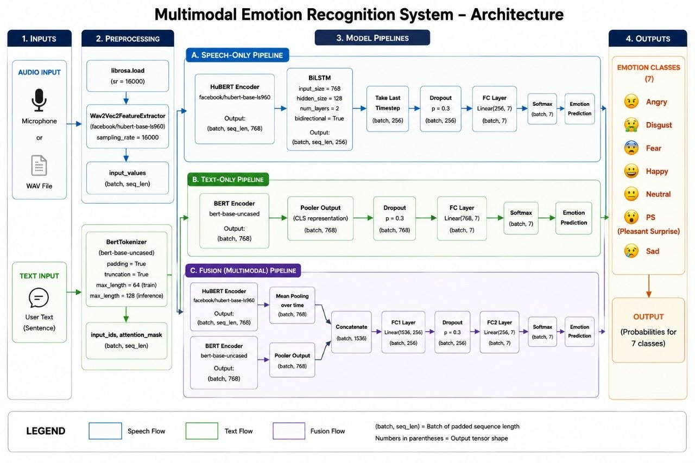

### Speech Pipeline

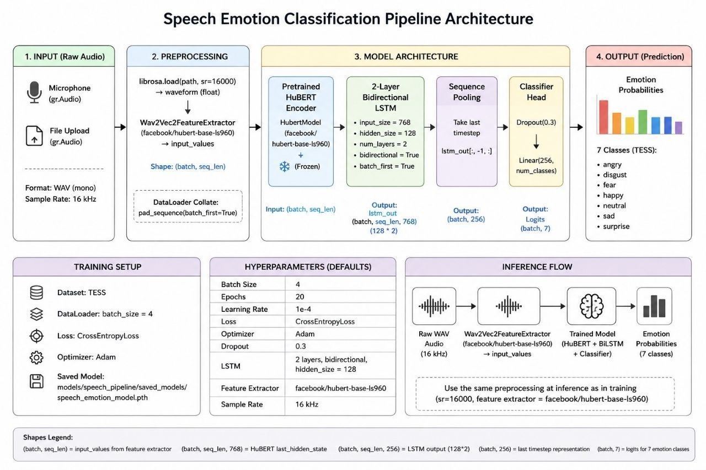

### Text Pipeline

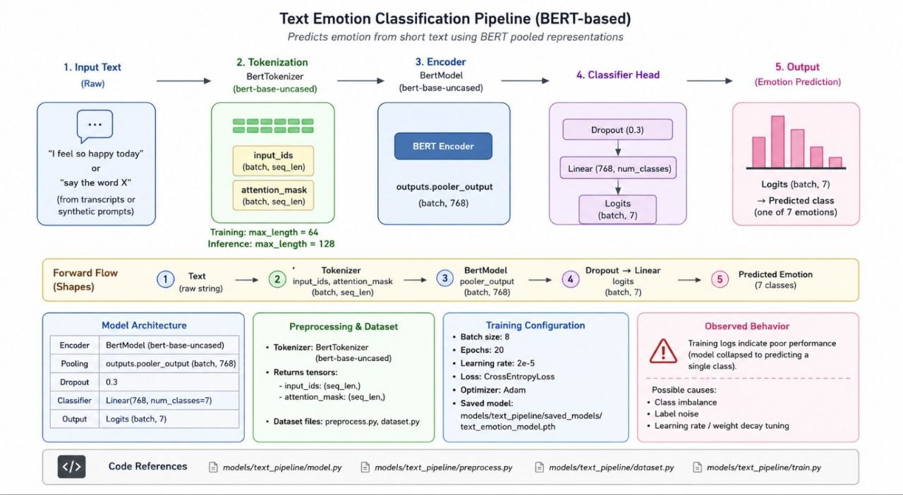

### Fusion Pipeline

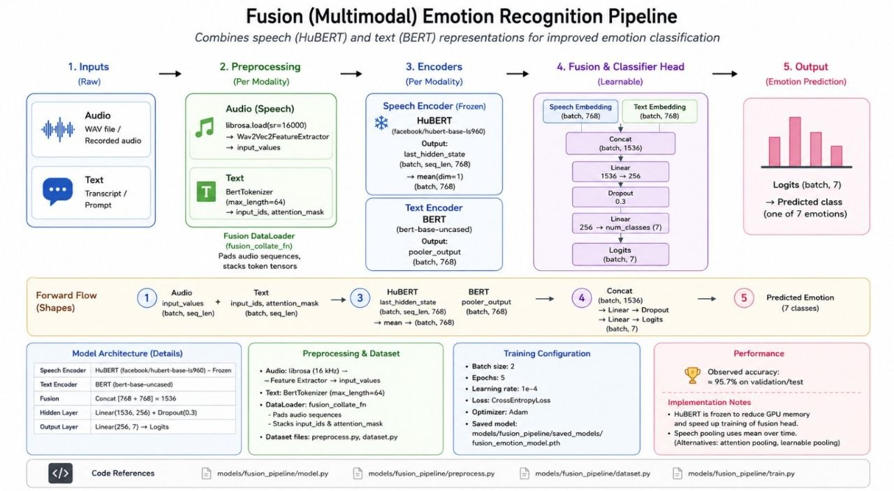

## Model Architectures

### Speech Model

Notebook: models/speech_pipeline/speechv3.ipynb

- Input: HuBERT mean pooled embedding (768)
- Reshape to (1, 768)
- Bidirectional LSTM (128)
- Dropout (0.3)
- Dense (128, ReLU)
- Dropout (0.3)
- Dense (num classes, Softmax)

### Text Model

Notebook: models/text_pipeline/textv3.ipynb

- Input: BERT pooler output (768)
- Dense (256, ReLU)
- Dropout (0.3)
- Dense (128, ReLU)
- Dropout (0.3)
- Dense (num classes, Softmax)

### Fusion Model

Notebook: models/fusion_pipeline/fusionv3.ipynb

- Input: Concatenated speech + text embeddings (1536)
- Dense (512, ReLU)
- Dropout (0.4)
- Dense (256, ReLU)
- Dropout (0.4)
- Dense (128, ReLU)
- Dropout (0.3)
- Dense (num classes, Softmax)

## Results

### Metrics Files

- Results/metrics/speech.csv
- Results/metrics/text.csv
- Results/metrics/fusion.csv

### Summary Metrics

| Model | Accuracy | Macro Precision | Macro Recall | Macro F1 |
|---|---:|---:|---:|---:|
| Speech | 0.996429 | 0.996473 | 0.996429 | 0.996417 |
| Text | 0.140000 | 0.020000 | 0.140000 | 0.040000 |
| Fusion | 0.992857 | 0.992988 | 0.992857 | 0.992856 |

### Confusion Matrices

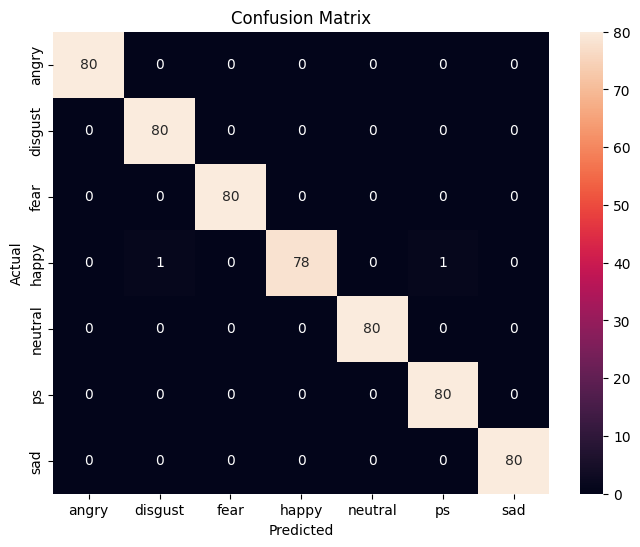

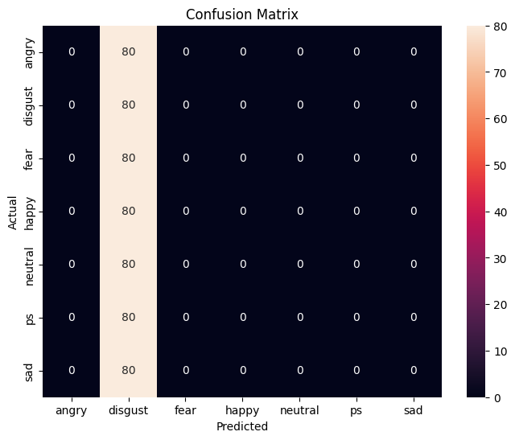

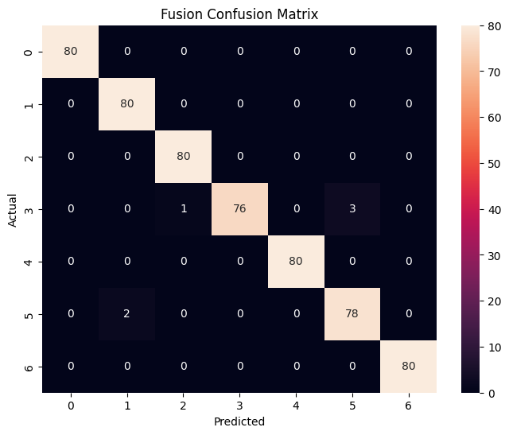

### Training Curves

Speech:

- 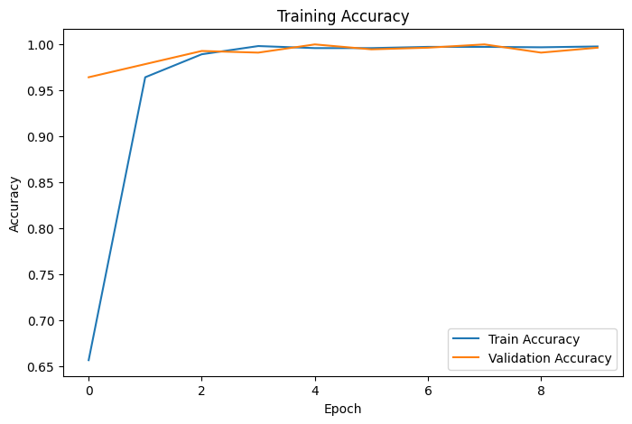
- 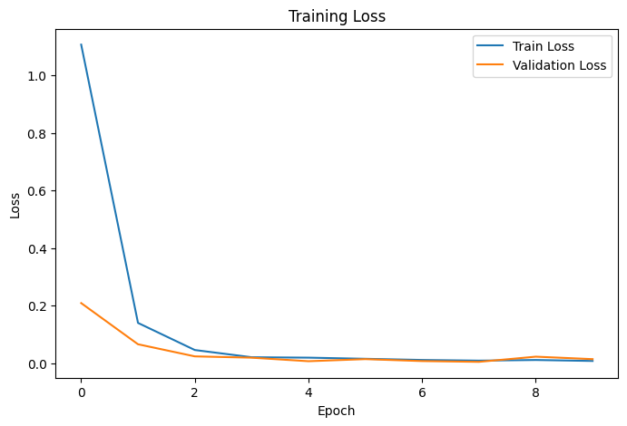

Text:

- 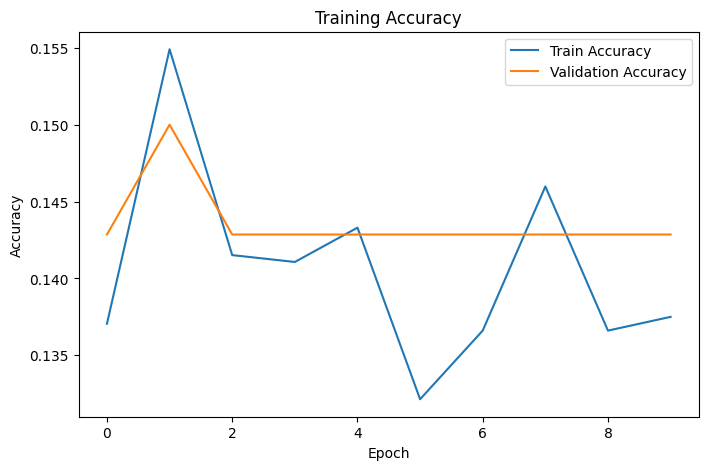
- 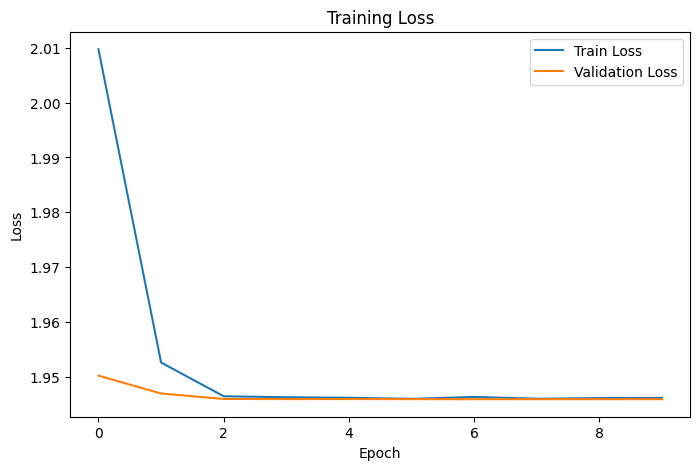

Fusion:

- 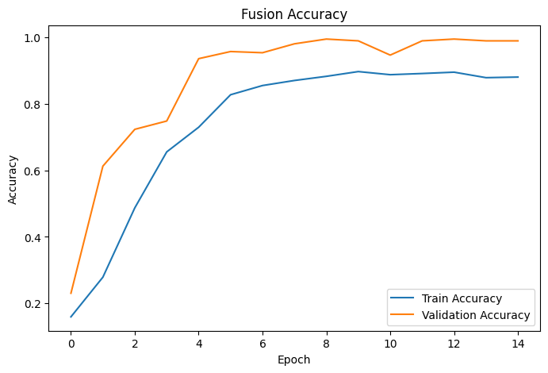
- 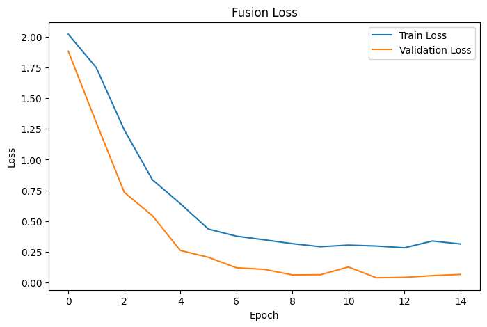

## Project Structure

- app.py: Gradio application and inference logic
- requirements.txt: Python dependencies
- models/: trained checkpoints and model artifacts
- data/TESS/: dataset folders used for training and evaluation
- Results/: metrics, confusion matrices, and plots
- MultiModal_Emotion_Recognition_Report.pdf: full project report

## Step-by-Step Setup (Copy and Run)

Follow these exact steps to run the project on a new system.

### 1. Install prerequisites

- Python 3.9 or newer
- pip
- Git (optional, only needed if cloning from GitHub)

### 2. Clone the repository

Open terminal and run:

```bash
git clone https://github.com/Priyanshdash/Multimodal-Emotion-Recognition.git
cd Multimodal-Emotion-Recognition
```

If your repository folder name is different, use that folder name in the second command.

### 3. Create and activate a virtual environment

Windows (PowerShell):

```powershell
python -m venv .venv
.\.venv\Scripts\Activate.ps1
```

Windows (Command Prompt):

```bat
python -m venv .venv
.venv\Scripts\activate.bat
```

macOS/Linux:

```bash
python3 -m venv .venv
source .venv/bin/activate
```

### 4. Install dependencies

```bash
pip install --upgrade pip
pip install -r requirements.txt
```

### 5. Verify model files are present

Make sure these files exist before running:

- models/speech_pipeline/speech_emotion_model.h5
- models/text_pipeline/text_emotion_model.h5
- models/fusion_pipeline/fusion_emotion_model.h5

### 6. Run the app

```bash
python app.py
```

### 7. Open in browser

After startup, Gradio prints a local URL in terminal (usually http://127.0.0.1:7860).
Open that URL in your browser.

### 8. Test each mode

- speech: upload or record audio
- text: enter a sentence
- fusion: provide both audio and text

The app returns predicted emotion and class probabilities.

### 9. Common first-run note

On first run, Hugging Face models may be downloaded. This can take time depending
on internet speed.
For the text mode first click on classify and then try it out

## Checkpoint Files Required

- models/speech_pipeline/speech_emotion_model.h5
- models/text_pipeline/text_emotion_model.h5
- models/fusion_pipeline/fusion_emotion_model.h5

## Notes

- Use Git LFS for large model files.
- Hugging Face models are downloaded on first run and cached locally.
- For reproducibility, pin exact versions in requirements.txt.

## Attribution

Please cite the TESS dataset and pretrained Hugging Face models used in this
project if you reuse this work.

